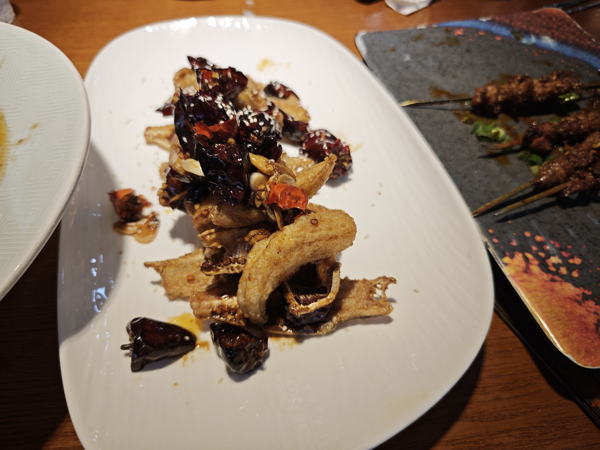

# 2025-9-30
今天是国庆节前的最后一天了，昨天和同学商量好今天一起出去吃顿饭，于是中午去了一家川菜馆吃炒菜。点了几道菜：沙葱炒牛肉、烤羊肉串和耗儿鱼。味道都不错，耗儿鱼是第一次吃，从照片也能看出来正经的鱼肉也没多少，很多都是炸酥了的骨头，吃起来还别有一种感觉。羊肉串一把三十块钱，我还以为会很多的，没想到只有这么一点。中午回寝室收拾好行李就踏上回家的路了，没想到国庆前一天车站的人就有那么多，仅仅是上厕所的人都排了有三十米左右。好在我刚买完票就成功入站，刚上车就发车了，也算是运气非常好了。
  